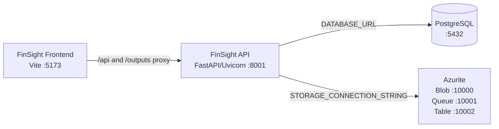

# Azure Debug Plan

> This plan is the source of truth for generating the VS Code debug setup in this workspace.
>
> **Status:** Implemented
> **Execution Mode:** Guided
> **Created:** 2026-09-17T00:00:00Z
> **Last Updated:** 2026-09-17T18:45:00Z
>
> <!-- Guided Mode (default) - hand-holds the user through review and approval before generating. -->

---

## Prerequisites

| Tool / Extension                                 | Category          | Service(s) | Installed | Version                        |
| ------------------------------------------------ | ----------------- | ---------- | --------- | ------------------------------ |
| Python                                           | Runtime           | backend    | ✅        | 3.14.0                         |
| pip                                              | Package manager   | backend    | ✅        | 26.1.2                         |
| Node.js                                          | Runtime           | frontend   | ✅        | 24.11.1                        |
| npm                                              | Package manager   | frontend   | ✅        | 11.6.2                         |
| Docker                                           | Container runtime | backend    | ✅        | 29.8.0                         |
| Docker Compose                                   | Compose provider  | backend    | ✅        | v5.5.1                         |
| Python extension (`ms-python.python`)            | VS Code debug     | backend    | ✅        | 2026.4.0                       |
| Pylance (`ms-python.vscode-pylance`)             | VS Code support   | backend    | ✅        | 2026.3.1                       |
| JavaScript Debugger (`ms-vscode.js-debug`)       | VS Code debug     | frontend   | ✅        | Built-in debugger extension    |
| Chrome                                           | Browser           | frontend   | ✅        | Installed; version not queried |
| Docker extension (`ms-azuretools.vscode-docker`) | Container tooling | backend    | ✅        | 2.0.0                          |

> All required prerequisites were positively detected. The nested `Main/` directory is a separate copied repository and is excluded from this active workspace plan.
> Credentials such as `GOOGLE_API_KEY`, `GROQ_API_KEY`, `PINECONE_API_KEY`, and `HUGGINGFACE_API_KEY` must remain in `backend/.env` or the user environment; do not put them in generated debug configuration or source control.

---

## Debug Configurations

Each checked row below produces a VS Code debug configuration in `.vscode/launch.json`.

| Generate | Debug Config Name         | Service Label      | Service Root | Project Type      | Runtime | Version | Azure Dependencies       |
| -------- | ------------------------- | ------------------ | ------------ | ----------------- | ------- | ------- | ------------------------ |
| [x]      | FinSight API (debug)      | FinSight API       | ./backend    | app-service       | python  | 3.14.0  | PostgreSQL, Blob Storage |
| [x]      | FinSight Frontend (debug) | FinSight Frontend  | ./frontend   | frontend-spa      | node-js | 24.11.1 | —                        |
| [x]      | Debug All Services        | Debug All Services | —            | _Compound Config_ | —       | —       | PostgreSQL, Blob Storage |

ℹ️ Project Type Descriptions

| Project Type      | Description                                                                            |
| ----------------- | -------------------------------------------------------------------------------------- |
| app-service       | HTTP server application using FastAPI/Uvicorn.                                         |
| frontend-spa      | React single-page application served by the Vite development server.                   |
| _Compound Config_ | Starts the backend and frontend with PostgreSQL and Azurite available through Compose. |

> ℹ️ **Proxy detected:** Vite proxies `/api` and `/outputs` to `http://localhost:8001`. The compound config must start the backend before the frontend.
>
> ℹ️ **Existing configuration:** `.vscode/launch.json` and `.vscode/tasks.json` already contain the service configurations, compound configuration, dependency installation, service startup, and emulator startup entries. Generation must preserve the existing service/debug entries and make emulator startup target only PostgreSQL and Azurite so host processes do not conflict with Compose backend/frontend containers.

---

## Orchestrator

| Orchestrator   | Container Runtime | Compose Command  | Description                                                                                                                                                                 |
| -------------- | ----------------- | ---------------- | --------------------------------------------------------------------------------------------------------------------------------------------------------------------------- |
| Docker Compose | Docker            | `docker compose` | Uses Docker Desktop to run PostgreSQL and Azurite for local development. Preserve the existing `docker-compose.yml`; start only the dependency services for host debugging. |

---

## Emulators

| Dependent Service | Emulator                | Purpose                                                                                         |
| ----------------- | ----------------------- | ----------------------------------------------------------------------------------------------- |
| PostgreSQL        | PostgreSQL 16 container | Durable document, job, entity, clause, and RAG metadata storage on `localhost:5432`.            |
| Blob Storage      | Azurite container       | Local Azure Blob-compatible storage on ports `10000-10002` for documents and derived artifacts. |

> LM Studio remains an external OpenAI-compatible provider at `http://localhost:1234/v1`. Pinecone and hosted Google/Groq/Hugging Face providers remain optional external dependencies and are not emulated by this plan.
>
> **Readiness check:** `docker compose config` passes; PostgreSQL is healthy on `localhost:5432`; Azurite is healthy on ports `10000-10002`. Azurite uses a TCP healthcheck because its unauthenticated root HTTP request correctly returns `400`.

---

## Architecture Diagram

During debugging, the host-run FastAPI and Vite services use Docker Compose for PostgreSQL and Azurite; Vite proxies API and output requests to FastAPI.

---

## Migrations

When selected, the generation phase creates automated VS Code tasks that run migration scripts on launch.

| Generate | Service      | Migration Tool                                                                                                                                          |
| -------- | ------------ | ------------------------------------------------------------------------------------------------------------------------------------------------------- |
| [ ]      | FinSight API | Alembic-style file under `./backend/migrations/001_initial_schema.py`; `alembic`, `sqlalchemy`, `alembic.ini`, and a migration runner were not detected |

> ⚠️ **Migration gap:** Do not generate a migration command until Alembic/SQLAlchemy dependencies and the project’s migration runner are added. The current plan can start the services and emulators without applying this schema automatically.

---

## API Test Collections

When selected, the generation phase produces lightweight, runnable API test scripts so endpoints can be smoke-tested once services and emulators are running.

| Generate | Service      | Description                                                                                                                                                                                                                                                                                                                                                                                                                                                                                                                                                                                                                                                                                                                                                                                                                                                                                                                                                                                                                                                                                                                                                                                                                                                                                               |
| -------- | ------------ | --------------------------------------------------------------------------------------------------------------------------------------------------------------------------------------------------------------------------------------------------------------------------------------------------------------------------------------------------------------------------------------------------------------------------------------------------------------------------------------------------------------------------------------------------------------------------------------------------------------------------------------------------------------------------------------------------------------------------------------------------------------------------------------------------------------------------------------------------------------------------------------------------------------------------------------------------------------------------------------------------------------------------------------------------------------------------------------------------------------------------------------------------------------------------------------------------------------------------------------------------------------------------------------------------------- |
| [x]      | FinSight API | 

HTTP Endpoints (30)
 GET / GET /api/v1/pipeline/pipeline-status GET /api/v1/pipeline/pipeline-options POST /api/v1/pipeline/test-upload POST /api/v1/pipeline/process-document POST /api/v1/pipeline/process-text POST /api/v1/ner/extract-entities GET /api/v1/ner/model-status POST /api/v1/ner/load-model POST /api/v1/ner/train-model GET /api/v1/ner/entity-types POST /api/v1/langextract/extract-clauses GET /api/v1/langextract/service-status PUT /api/v1/langextract/update-prompt POST /api/v1/langextract/add-example GET /api/v1/langextract/clause-types GET /api/v1/langextract/current-prompt POST /api/v1/finbert/analyze-sentiment POST /api/v1/finbert/analyze-document POST /api/v1/finbert/analyze-text-sentences GET /api/v1/finbert/model-status POST /api/v1/finbert/load-model GET /api/v1/finbert/sentiment-colors GET /api/v1/finbert/sentiment-labels POST /api/v1/rag/upload-document POST /api/v1/rag/query GET /api/v1/rag/status DELETE /api/v1/rag/clear POST /api/v1/export/results POST /api/v1/export/generate-report  

Static Routes
 GET /uploads/{filename} GET /outputs/{filename}
 |

> No authentication registration, login, or current-user route is currently registered in `backend/app.py` or its included routers; the API test collection therefore contains only implemented routes.

## Debug Configuration Checklist

Debug Configuration Checklist:
✅ FinSight API (debug) — Uvicorn ready signal observed (`Uvicorn running on http://0.0.0.0:8001`); `GET /` returned HTTP 200 with `{"status":"ok"}`.
✅ FinSight Frontend (debug) — Vite ready signal observed (`Local: http://localhost:5173/`); frontend returned HTTP 200.
✅ Debug All Services — PostgreSQL and Azurite were healthy; backend started once before frontend, both ready signals were observed, and both HTTP checks returned 200. Duplicate task invocations are guarded by `instanceLimit: 1` and `instancePolicy: "silent"`.

> Validation note: the generated Bash API helper was not executable in the available Windows Bash environment because `python` was not on that shell's PATH and it could not see the Windows host listener. The equivalent host PowerShell request passed with HTTP 200 and the expected response body.

---

## Convenience Scripts

| Generate | Script | Registered In | Description                                                                                                                    |
| -------- | ------ | ------------- | ------------------------------------------------------------------------------------------------------------------------------ |
| [ ]      | —      | —             | No root package script runner is present. Use the generated VS Code tasks and the existing `run_app.py`/`start.bat` launchers. |
