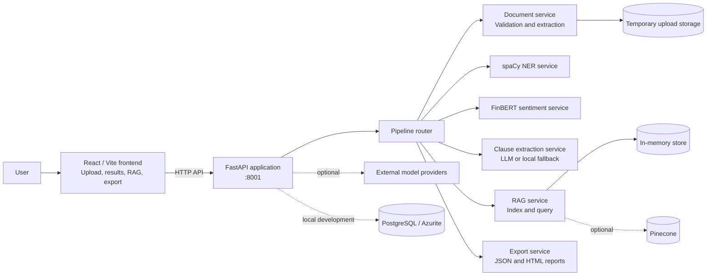

# FinSight AI: Second Implementation Review and Technical Documentation

## 1. Purpose of This Report

This document records the implementation completed in the FinSight AI repository at the time of the second review. It is based on the active root application, source-code inspection, project configuration, and local execution of the available verification commands.

The report is intentionally focused on the current state of the system. It explains what has been built, how the parts work together, what was verified successfully, and which boundaries still apply. It does not present planned improvements as completed features, and it does not claim model accuracy that has not been measured against an independent labelled dataset.

## 2. Current Implementation Summary

FinSight AI is a working full-stack prototype for analysing financial and legal documents. The implemented workflow accepts a document, extracts its text, runs several analysis services, indexes the extracted content for contextual questions, and presents the results through a React interface.

The current implementation includes:

- A FastAPI backend with versioned analysis routes.
- A React/Vite frontend with upload, results, chatbot/RAG, navigation, theme support, and protected user-facing views.
- Document handling for PDF, TXT, DOCX, DOC, and HTML extensions, with file-size and extension validation.
- Text extraction using direct text reading, `pypdf`, and `python-docx`.
- A locally stored spaCy model for named entity recognition.
- FinBERT sentiment analysis, including sentence-level results.
- Financial and legal clause extraction using an offline rule-based fallback and optional model providers.
- RAG indexing and question answering with an in-memory fallback and optional external integrations.
- JSON-oriented API responses and generated HTML reports.
- Docker and VS Code development support for the local service environment.
- A working offline demonstration path that does not require every external AI provider to be available.

The implementation should therefore be described as an integrated prototype. The main workflow is present and executable, but the repository does not yet provide the evidence needed to describe the system as production-ready or empirically validated for financial-domain accuracy.

## 3. Repository Structure

The active application is organised into the following areas:

- **Backend:** The FastAPI application is defined in [backend/app.py](backend/app.py#L1-L56). Configuration is handled in [backend/config.py](backend/config.py#L1-L180). API routers are in `backend/routers/`, and the analysis logic is in `backend/services/`.
- **Frontend:** The React/Vite application is contained in `frontend/src/`. Routing and page protection are defined in [frontend/src/App.jsx](frontend/src/App.jsx#L1-L70), while backend calls are grouped in [frontend/src/services/api.js](frontend/src/services/api.js#L1-L230).
- **Models:** The custom spaCy model is stored under `backend/models/ner_model/`. FinBERT is loaded through the Transformers library.
- **Operations:** Docker Compose, the backend Dockerfile, environment templates, startup scripts, and VS Code tasks support local development.
- **Verification:** [test_pipeline.py](test_pipeline.py#L1-L82) tests the central workflow. [verify_system.py](verify_system.py#L1-L120) checks local dependencies and service availability.

The `Main/` directory is a copied legacy project snapshot. The active root README identifies it as separate from the root launch configuration ([README.md](README.md#L31-L31)). It was considered during the review, but the implementation described in this report is the active root application.

## 4. System Architecture

The system follows a client-server architecture. The browser communicates with the FastAPI application, and the backend coordinates document processing and analysis services. Optional infrastructure includes PostgreSQL, Azurite, cloud/model providers, and Pinecone; the core demonstration can run with local fallbacks.

### 4.1 Request flow

The main document-processing route is `POST /api/v1/pipeline/process-document`:

1. The frontend sends the selected file and analysis options as multipart form data.
2. The backend checks that the file is present, non-empty, within the configured size limit, and has an allowed extension.
3. The file is written to temporary upload storage with a generated filename.
4. The document service extracts text and, where available, HTML content.
5. The enabled analysis services process the extracted text.
6. The extracted text is added to the RAG knowledge base.
7. A structured response containing file metadata, analysis results, pipeline status, and summary information is returned.
8. The temporary uploaded file is removed in a cleanup step.

The pipeline implementation is located in [backend/routers/pipeline_router.py](backend/routers/pipeline_router.py#L77-L252). Individual analysis failures are represented in the response so that one unavailable service does not necessarily prevent the other available services from returning results.

## 5. Completed Backend Components

### 5.1 Application and API layer

The active FastAPI application registers routes for pipeline processing, NER, clause extraction, FinBERT, RAG, and exports ([backend/app.py](backend/app.py#L35-L41)). It also provides a root health response and creates the upload/output directories at startup.

The application currently exposes the following functional areas:

| Area              | Implemented responsibility                                                         |
| ----------------- | ---------------------------------------------------------------------------------- |
| Health            | Confirms that the API process is running.                                          |
| Pipeline          | Coordinates extraction, NER, clauses, sentiment, and RAG indexing.                 |
| NER               | Loads the custom spaCy model and returns recognised entities and spans.            |
| FinBERT           | Produces financial sentiment labels, scores, and sentence-level results.           |
| Clause extraction | Extracts financial/legal clauses using a provider or deterministic local fallback. |
| RAG               | Adds document text to a knowledge base and answers contextual questions.           |
| Export            | Produces downloadable analysis data and HTML reports.                              |

### 5.2 Document processing

The document service validates supported extensions and applies a 50 MB file limit ([backend/config.py](backend/config.py#L140-L141), [backend/services/docling_service.py](backend/services/docling_service.py#L177-L187)). The active extraction paths are:

- TXT: direct UTF-8 reading;
- PDF: page extraction through `pypdf`;
- DOCX/DOC: paragraph extraction through `python-docx`;
- HTML and unsupported formats: accepted at validation level but requiring careful confirmation of the active extraction behaviour.

The service assigns metadata such as file extension, size, page count where available, and extraction method. The original Docling converter is not active in the current lightweight path; the service uses the implemented fallback methods instead ([backend/services/docling_service.py](backend/services/docling_service.py#L1-L35)).

### 5.3 Named entity recognition

The backend loads a custom spaCy model from the repository and returns entity text, labels, character positions, and counts. The repository also includes model-building and annotation assets under `backend/models/ner_model/`. The integration is exercised by the pipeline test and by the diagnostic script.

### 5.4 Sentiment analysis

FinBERT is loaded through Transformers and used for financial sentiment classification. The pipeline supports document-level processing and sentence-level results. The local test run successfully loaded the model and returned sentiment output for the sample document.

### 5.5 Clause extraction

Clause extraction has two operating modes. When a configured local or cloud model is available, the service can use it. When no provider is available, the implementation falls back to deterministic keyword and sentence-boundary rules. This fallback is an important completed feature because it keeps the main demonstration reproducible in an offline environment.

### 5.6 Retrieval-augmented generation

The RAG service can split extracted text into chunks, index those chunks, retrieve relevant passages, and produce a contextual response. The current local fallback keeps indexed documents in process memory. Optional integrations include external embeddings, an LLM provider, and Pinecone. The pipeline adds successfully extracted document text to the RAG store after the analysis stages ([backend/routers/pipeline_router.py](backend/routers/pipeline_router.py#L203-L223)).

## 6. Completed Frontend Components

The frontend is a usable React application rather than a static presentation layer. It includes:

- Home and about views;
- authenticated upload and results routes;
- a multi-step upload flow;
- selection of analysis features;
- analysis result cards and visual summaries;
- a RAG/chatbot page;
- report generation and download behaviour;
- responsive layouts and theme switching;
- Clerk integration for the user-facing authentication experience.

The frontend API module connects the interface to the active backend pipeline, FinBERT, clause, RAG, export, and health routes ([frontend/src/services/api.js](frontend/src/services/api.js#L1-L230)). The production build completes successfully. The build does report a large JavaScript chunk of approximately 848 kB before gzip and an import-splitting warning; these are current build observations, not evidence that the frontend fails.

## 7. Operations and Configuration Completed

The repository includes local-development support for:

- Python dependency installation through `backend/requirements.txt`;
- frontend dependency installation through `frontend/package.json`;
- a backend Dockerfile;
- Docker Compose services for PostgreSQL and Azurite;
- environment templates for optional providers;
- VS Code tasks for starting emulators, the API, and the frontend;
- root startup and verification scripts;
- generated API test collections and backend documentation.

The project can run in an offline configuration for the central demonstration. Cloud providers and external vector storage remain optional configuration paths rather than requirements for the local smoke test.

## 8. Verification Completed

The following checks were run against the active repository:

| Check                            | Result         | What it confirms                                                                                                                     |
| -------------------------------- | -------------- | ------------------------------------------------------------------------------------------------------------------------------------ |
| `python -m pytest -q`            | Passed: 1 test | The included automated pipeline test completes successfully. Three deprecation warnings remain.                                      |
| `python test_pipeline.py`        | Passed         | The sample document passed through upload, extraction, custom NER, FinBERT, clause extraction, RAG indexing, and RAG query fallback. |
| `npm run build` from `frontend/` | Passed         | The active React/Vite frontend compiles into a production bundle.                                                                    |
| Repository inspection            | Completed      | Active backend, frontend, services, configuration, Docker files, tests, documentation, and the legacy snapshot were reviewed.        |

During the end-to-end run, the system returned 14 NER entities, sentence-level FinBERT results, three extracted clauses, and a successful offline RAG response for the included sample document. These results confirm that the principal components are connected and executable. They do not, by themselves, establish domain accuracy or production readiness.

## 9. Current Boundaries and Incomplete Areas

The following items are not presented as completed capabilities:

- **Formal NLP evaluation:** The repository does not include an independent labelled benchmark with precision, recall, F1, or confusion-matrix results.
- **Production authentication:** Clerk protects selected frontend routes, but backend enforcement is not consistently applied to every sensitive API and static-file path.
- **Persistent multi-user RAG:** The offline RAG fallback is process-local, so data can disappear on restart and is not yet a complete tenant-isolated store.
- **Security hardening:** CORS is permissive, uploads/outputs are mounted as static paths, and request-controlled model/provider parameters need a stronger server-side trust boundary.
- **Broad automated coverage:** The current test surface does not comprehensively cover malformed files, oversized inputs, authorization, concurrency, provider failure, export escaping, or cross-user isolation.
- **Documentation alignment:** Some older API documentation describes routes that are not registered in the active application, including the commented Docling router ([backend/app.py](backend/app.py#L35-L41)).
- **Legacy duplication:** The `Main/` snapshot duplicates much of the project and can create confusion about which implementation is current.
- **Bounded large-document processing:** Model work occurs within request processing and requires stronger chunking, limits, progress reporting, and timeout behaviour for larger workloads.

These boundaries describe the present implementation state. They should be kept separate from the completed feature list when the project is presented academically or demonstrated to reviewers.

## 10. Technical Conclusion

The second implementation review confirms that FinSight AI has progressed beyond a design proposal. The repository contains a connected backend, frontend, model layer, RAG path, export path, local development setup, and working verification flow. The strongest completed aspect is the end-to-end integration: a sample financial document can be uploaded, analysed by multiple services, indexed, queried, and displayed through the application workflow, including offline fallbacks.

The appropriate technical description is therefore **an integrated financial-document analysis prototype with a working offline demonstration path**. It should not yet be described as a production-secure platform or as a scientifically evaluated NLP system. That distinction accurately reflects what has been completed in the repository and gives the implementation a clear, credible status for the second review.
